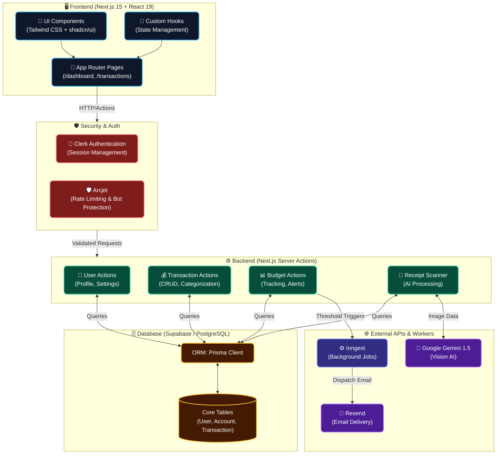
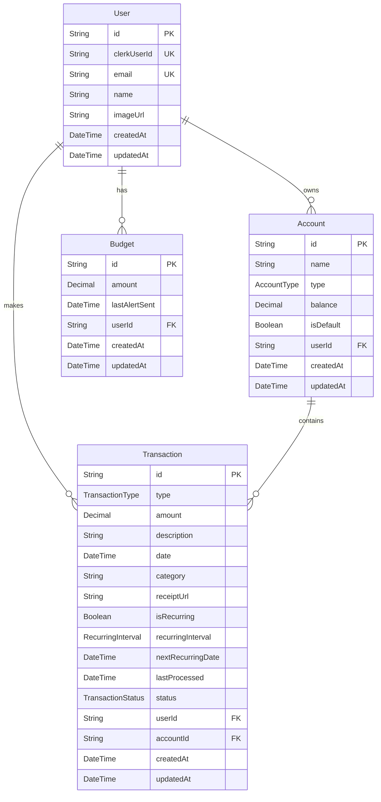

<div align="center">
  <br />
  <a href="https://fin-os-self.vercel.app/">
    
  </a>
  <h1>FinOS</h1>
  <p><strong>Your Intelligent, AI-Powered Financial Operating System</strong></p>
  <br />

  <!-- Badges -->
  <p>
    
    
    
    
    
    
  </p>
</div>

<br />

<div align="center">
  <h3><a href="https://fin-os-self.vercel.app/">🟢 Live Demo</a></h3>
</div>

<br />

> **FinOS** is a next-generation personal finance tracker built with Next.js 15, Prisma, and Tailwind CSS. It goes beyond simple expense tracking by featuring a stunning dark glassmorphism UI and leveraging machine learning (Google Gemini) to automatically scan receipts, categorize transactions, and generate actionable financial insights. 

---

## 📑 Table of Contents

- [✨ Features & Use Cases](#-features--use-cases)
- [🧠 Technical Decisions & Challenges](#-technical-decisions--challenges)
- [🏗️ System Architecture](#️-system-architecture)
- [🗄️ Database Architecture](#️-database-architecture)
- [💻 Tech Stack](#-tech-stack)
- [📂 Project Structure](#-project-structure)
- [🚀 Quick Start](#-quick-start)
- [🗺️ Roadmap](#️-roadmap)
- [📄 License](#-license)

---

## ✨ Features & Use Cases

- 🧾 **AI Receipt Scanning**: Upload receipts directly from your phone or desktop. The integration with **Google Gemini AI** automatically extracts the vendor, amount, date, and categorizes the transaction—drastically reducing manual data entry and ensuring accurate records.
- 🏦 **Multi-Account Dashboard**: Manage checking, savings, and credit accounts from a unified, intuitive interface. Get real-time views of your net worth, cash flow, and monthly trends.
- 📊 **Dynamic Budgeting**: Track monthly expenses against highly customizable budgets. Visual progress indicators prevent overspending before it happens.
- 🔁 **Recurring Transactions engine**: Automatically handle subscriptions and recurring income. The system forecasts upcoming payments, ensuring you never miss a due date.
- 📬 **Automated Email Reports**: Background workers powered by **Inngest** and **Resend** deliver personalized, beautifully formatted monthly financial summaries directly to your inbox.
- 🛡️ **Enterprise-Grade Security**: Protected by **Arcjet** to proactively block abuse, brute-force attacks, and malicious bots, seamlessly integrated with **Clerk** for secure identity management.

---

## 🧠 Technical Decisions & Challenges

Building a robust financial application requires careful consideration of security, data integrity, and performance. Here are key technical decisions made during development:

1. **Serverless Background Processing (Inngest)**:
   - *Challenge*: Long-running tasks like sending bulk monthly emails or processing heavy AI image analyses frequently hit timeout limits in standard Vercel serverless functions.
   - *Solution*: Implemented **Inngest** for event-driven background jobs. This guarantees execution, handles retries gracefully, and entirely bypasses standard serverless timeouts.
2. **AI-Driven Data Structuring (Gemini)**:
   - *Challenge*: Traditional OCR often fails at extracting structured financial data (like parsing a messy restaurant receipt into JSON).
   - *Solution*: Leveraged **Google Gemini 1.5 Flash Vision**. By passing the image alongside a highly specific prompt, the LLM reliably returns structured JSON containing the exact fields required by the Prisma schema.
3. **Optimistic UI Updates (React 19 / Server Actions)**:
   - *Challenge*: Financial apps must feel snappy and responsive, even when saving complex transaction data to a remote database.
   - *Solution*: Used Next.js 15 Server Actions combined with React's new hook paradigms to provide optimistic UI updates, ensuring the dashboard feels instantaneous while data syncs securely in the background.

---

## 🏗️ System Architecture

The application is built on a modern, decoupled architecture ensuring scalability and separation of concerns.



---

## 🗄️ Database Architecture

A fully normalized PostgreSQL schema designed for high-performance querying and strong relational integrity.



---

## 💻 Tech Stack

| Layer | Technologies |
|---|---|
| **Frontend Framework** | Next.js 15 (App Router), React 19 |
| **Styling & UI** | Tailwind CSS v4, Framer Motion, shadcn/ui |
| **Backend Architecture**| Next.js Server Actions, Node.js |
| **Database & ORM** | PostgreSQL (hosted on Supabase), Prisma ORM |
| **Authentication** | Clerk Identity Management |
| **AI Processing** | Google Gemini 1.5 Flash Vision |
| **Event & Job Queue** | Inngest |
| **Email Delivery** | React Email, Resend |
| **Application Security**| Arcjet (WAF, Bot Protection, Rate Limiting) |

---

## 📂 Project Structure

```text
FinOS/
├── Backend/
│   ├── actions/               # Server-side business logic & data mutations
│   ├── database/              # Prisma schema definitions & migration logs
│   ├── security/              # Arcjet firewall rules & rate limit configs
│   └── services/              # Inngest event definitions & Resend templates
├── app/                       # Next.js App Router (Pages, Layouts, API endpoints)
├── components/                # Modular, reusable React UI Components
├── hooks/                     # Custom React Hooks for state & lifecycle
├── lib/                       # Global utility functions & shared helpers
├── public/                    # Static assets & icons
└── package.json               # Project dependencies & npm scripts
```

---

## 🚀 Quick Start

### Prerequisites

- Node.js 18+
- A PostgreSQL database (Supabase is highly recommended)
- API keys for: Clerk, Google Gemini, Resend, Arcjet, and Inngest

### Installation

1. **Clone the repository & install dependencies**
   ```bash
   npm install
   ```

2. **Configure your environment variables**
   Copy the example environment file and fill in your keys:
   ```bash
   cp .env.example .env
   ```

3. **Database Setup**
   Push the schema to your PostgreSQL database and generate the Prisma Client:
   ```bash
   npx prisma db push
   npx prisma generate
   ```

4. **Run the development server**
   ```bash
   npm run dev
   ```

5. **(Optional) Run Inngest dev server**
   To test background jobs and automated emails locally:
   ```bash
   npx inngest-cli@latest dev
   ```

Navigate to `http://localhost:3000` to view the app!

---

## 🔐 Environment Variables

Ensure the following variables are securely set in your `.env` file before running the application:

| Variable | Description |
|---|---|
| `DATABASE_URL` | Transactional PostgreSQL connection string |
| `DIRECT_URL` | Direct connection required for Prisma migrations |
| `NEXT_PUBLIC_CLERK_PUBLISHABLE_KEY` | Clerk Public Key for the frontend client |
| `CLERK_SECRET_KEY` | Clerk Secret Key for backend validation |
| `GEMINI_API_KEY` | Google Gemini API Key for Receipt Parsing |
| `RESEND_API_KEY` | Resend API Key for dispatching transactional emails |
| `ARCJET_KEY` | Arcjet Key for web application firewall & rate limiting |
| `INNGEST_EVENT_KEY` | Inngest Key to trigger background processes |

---

## 🗺️ Roadmap

- [ ] **Plaid Integration**: Allow users to securely connect directly to their bank accounts for automatic transaction fetching.
- [ ] **Advanced AI Forecasting**: Utilize historical transaction data to predict future cash flow bottlenecks.
- [ ] **Data Export**: Allow users to export their financial data to CSV and PDF formats for tax preparation.
- [ ] **Mobile Application**: Port the web app to a native mobile experience using React Native.

---

## 📄 License

This project is licensed under the **GNU General Public License v3.0**.

---

<div align="center">
  <p>Crafted with ❤️ by <strong>Shreedhar K B</strong></p>
</div>
