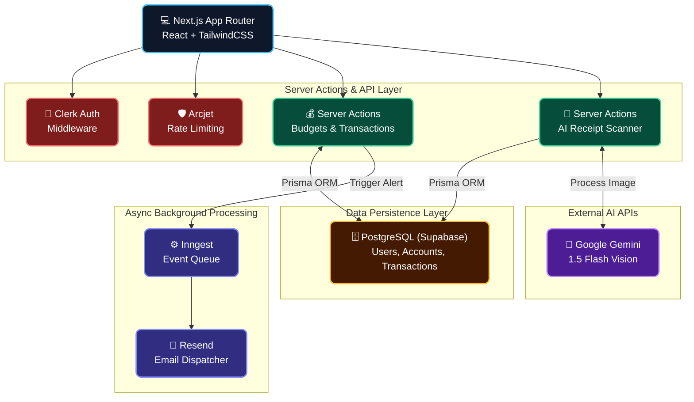
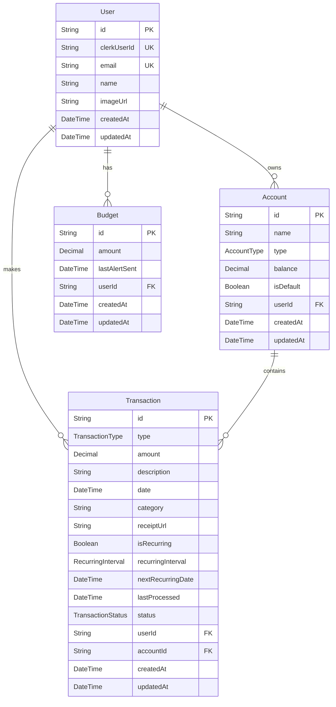

<div align="center">
  <br />
  <a href="https://fin-os-self.vercel.app/">
    
  </a>
  <h1>FinOS</h1>
  <p><strong>Your Intelligent, AI-Powered Financial Operating System</strong></p>
  <br />

  <!-- Badges -->
  <p>
    
    
    
    
    
  </p>
</div>

<br />

<div align="center">
  <h3><a href="https://fin-os-self.vercel.app/">🟢 Live Demo</a></h3>
</div>

<br />

> **FinOS** is a next-generation personal finance tracker built with Next.js 15, Prisma, and Tailwind CSS. It features a stunning dark glassmorphism UI and leverages machine learning (Google Gemini) to automatically scan receipts and generate actionable financial insights.

---

## 📑 Table of Contents

- [✨ Features](#-features)
- [🏗️ Architecture](#️-architecture)
- [🗄️ Database Architecture](#️-database-architecture)
- [💻 Tech Stack](#-tech-stack)
- [📂 Project Structure](#-project-structure)
- [🚀 Quick Start](#-quick-start)
- [🔐 Environment Variables](#-environment-variables)
- [📄 License](#-license)

---

## ✨ Features

- 🧾 **AI Receipt Scanning**: Upload receipts and let Gemini AI automatically extract the amount, date, and categorize the transaction. This drastically reduces manual data entry and ensures accurate categorization.
- 🏦 **Multi-Account Tracking**: Manage multiple checking, savings, and credit accounts from one comprehensive dashboard. Get a unified view of your net worth and cash flow.
- 📊 **Dynamic Budgeting**: Track your monthly expenses against customizable budgets with visual progress indicators. 
- 🔁 **Recurring Transactions**: Automatically handle subscriptions and recurring income so you never miss a payment and can forecast balances accurately.
- 📬 **Automated Reports**: Uses Inngest for reliable background execution and Resend to deliver personalized monthly financial summaries directly to your inbox.
- 🛡️ **Enterprise-Grade Security**: Protected by Arcjet to prevent abuse and brute-force attacks, with Clerk handling secure, seamless authentication.

---

## 🏗️ Architecture



---

## 🗄️ Database Architecture



---

## 💻 Tech Stack

| Layer | Technologies |
|---|---|
| **Frontend** | Next.js 15, React 19, Tailwind CSS v4, Framer Motion, shadcn/ui |
| **Backend** | Next.js Server Actions, Node.js |
| **Database** | PostgreSQL (via Supabase), Prisma ORM |
| **Authentication** | Clerk |
| **AI / LLM** | Google Gemini 1.5 Flash |
| **Background Jobs** | Inngest |
| **Email Service** | React Email, Resend |
| **Security** | Arcjet |

---

## 📂 Project Structure

```text
FinOS/
├── Backend/
│   ├── actions/               # Next.js Server Actions (budgets, transactions)
│   ├── database/              # Prisma schema & migrations
│   ├── security/              # Arcjet configurations & rules
│   └── services/              # Inngest functions, Resend templates
├── app/                       # Next.js App Router (pages, layouts, APIs)
├── components/                # React UI Components (shadcn/ui + custom)
├── hooks/                     # Custom React Hooks
├── lib/                       # Utility functions & shared helpers
├── public/                    # Static assets
└── package.json               # Dependencies & scripts
```

---

## 🚀 Quick Start

### Prerequisites

- Node.js 18+
- PostgreSQL database (Supabase recommended)
- Accounts/API keys for: Clerk, Gemini, Resend, Arcjet, and Inngest

### Installation

1. **Clone the repository & install dependencies**
   ```bash
   npm install
   ```

2. **Configure your environment**
   Copy `.env.example` to `.env` and fill in your keys:
   ```bash
   cp .env.example .env
   ```

3. **Database Setup**
   Push the schema to your database and generate the Prisma Client:
   ```bash
   npx prisma db push
   npx prisma generate
   ```

4. **Run the development server**
   ```bash
   npm run dev
   ```

5. **(Optional) Run Inngest dev server**
   To test background jobs locally:
   ```bash
   npx inngest-cli@latest dev
   ```

Navigate to `http://localhost:3000` to view the app!

---

## 🔐 Environment Variables

Ensure the following variables are set in your `.env`:

| Variable | Description |
|---|---|
| `DATABASE_URL` | PostgreSQL connection string (Supabase) |
| `DIRECT_URL` | Direct connection for Prisma migrations |
| `NEXT_PUBLIC_CLERK_PUBLISHABLE_KEY` | Clerk Auth Publishable Key |
| `CLERK_SECRET_KEY` | Clerk Auth Secret Key |
| `GEMINI_API_KEY` | Google Gemini API Key |
| `RESEND_API_KEY` | Resend Email API Key |
| `ARCJET_KEY` | Arcjet Security Key |
| `INNGEST_EVENT_KEY` | Inngest Event Key |

---

## 📄 License

This project is licensed under the **GNU General Public License v3.0**.

---

<div align="center">
  <p>Crafted with ❤️ by <strong>Shreedhar K B</strong></p>
</div>
