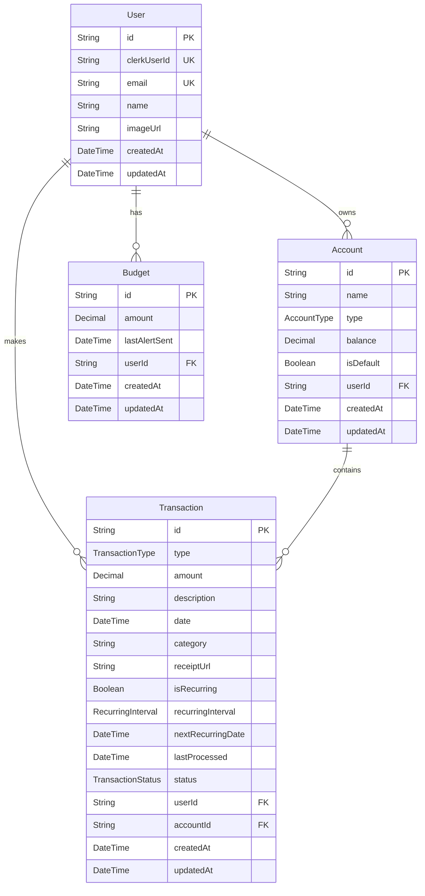

# FinOS

**Live:** [fin-os-self.vercel.app](https://fin-os-self.vercel.app/)

AI-powered financial operating system. FinOS moves beyond passive expense tracking by combining a dashboard UI with Google Gemini 1.5 Flash Vision to scan receipts, parse unstructured financial data, automate budget alerts, and generate financial insights — all backed by Next.js Server Actions, Prisma, and a serverless event-worker pipeline.

## Table of Contents

- [Features](#features)
- [Architecture](#architecture)
- [Database Schema](#database-schema)
- [Tech Stack](#tech-stack)
- [Project Structure](#project-structure)
- [Quick Start](#quick-start)
- [Environment Variables](#environment-variables)
- [Documentation](#documentation)

## Features

**AI Receipt Parsing**
Receipts can be uploaded from mobile or desktop. Google Gemini 1.5 Flash Vision reads the raw image, extracts merchant name, line items, date, and amount, and returns schema-compliant JSON that's written straight into the transaction table — no manual entry or brittle OCR regex.

**Multi-Account Aggregation**
A unified dashboard tracks current and savings balances, net worth trajectory, cash flow velocity, and spending habits across every linked account in one place.

**Dynamic Budget Guardrails**
Monthly budgets can be set per category. Progress bars update in real time, and an automated alert fires once spend crosses 80% of the budget for that category.

**Recurring Transaction Engine**
Upcoming bills and subscription renewals are forecast automatically. A daily background worker checks due dates and processes recurring transactions without any manual intervention.

**Automated AI Email Summaries**
A monthly cron job aggregates spend by category, asks Gemini for financial advice based on that data, and dispatches an HTML summary email via Resend — entirely in the background, outside the request/response cycle.

**Enterprise-Grade Security**
Every mutation passes through Arcjet WAF (bot defense, rate limiting capped at 1 request/minute per user for intensive operations) behind Clerk authentication, so abuse is blocked before it reaches business logic.

## Architecture

FinOS runs on a serverless architecture with clean boundaries between edge authentication, synchronous server actions, asynchronous event workers, and multi-modal AI inference.

graph TD
    %% Define Styles
    classDef user fill:#f9f9f9,stroke:#333,stroke-width:2px;
    classDef frontend fill:#e0f2fe,stroke:#0284c7,stroke-width:2px;
    classDef backend fill:#dcfce7,stroke:#16a34a,stroke-width:2px;
    classDef database fill:#fef08a,stroke:#ca8a04,stroke-width:2px;
    classDef external fill:#f3e8ff,stroke:#9333ea,stroke-width:2px;

    %% Client/User
    User((👤 Client / User)):::user

    %% Frontend Subgraph
    subgraph Frontend [Frontend - Next.js App Router]
        UI[UI Components <br/> React, Tailwind, Shadcn]:::frontend
        Pages[App Pages <br/> Dashboard, Transactions, Budgets]:::frontend
        UI --> Pages
    end

    %% Backend Subgraph
    subgraph Backend [Backend - Next.js Server]
        Middleware[Next.js Middleware <br/> routing & protection]:::backend
        AuthCheck[CheckUser <br/> Auth Validation]:::backend
        ServerActions[Server Actions <br/> Business Logic: Budget, Txns, Accounts]:::backend
        API_Routes[API Routes <br/> /api/inngest, /api/seed]:::backend
        Security[Arcjet <br/> Rate Limiting & Bot Protection]:::backend
        
        Middleware --> AuthCheck
        ServerActions --> Security
    end

    %% Database Subgraph
    subgraph DB_Layer [Data Persistence]
        Prisma[Prisma ORM]:::database
        DB[(PostgreSQL / Relational DB)]:::database
        Prisma --> DB
    end

    %% External Services Subgraph
    subgraph External_Services [Third-Party Services]
        Clerk[Clerk Auth]:::external
        Inngest[Inngest <br/> Background Jobs & Cron]:::external
        Resend[Email Provider <br/> Resend/JSX Templates]:::external
        ArcjetCloud[Arcjet Cloud]:::external
    end

    %% Interconnections
    User -->|HTTP/HTTPS| Middleware
    Middleware --> Pages
    Pages -->|Invokes| ServerActions
    Pages -.->|API Calls| API_Routes
    
    AuthCheck -->|Validates Session| Clerk
    Security -->|Verifies Request| ArcjetCloud
    
    ServerActions -->|Queries| Prisma
    API_Routes -->|Queries| Prisma
    
    ServerActions -->|Triggers| Inngest
    Inngest -.->|Executes Functions via Webhooks| API_Routes
    
    ServerActions -->|Sends Mail| Resend

Infrastructure layers:

- **Next.js 16 App Router + React 19** renders the dashboard and handles concurrent UI state with optimistic updates.
- **Clerk + Arcjet WAF** authenticate every request and block bots, SQL injection, and abusive mutation rates at the edge.
- **Next.js Server Actions** run synchronous business logic directly on the backend with no separate REST controller layer.
- **Google Gemini 1.5 Flash** powers both receipt-image parsing and monthly insight generation.
- **Prisma + Supabase PostgreSQL** persist `User`, `Account`, `Transaction`, and `Budget` records with connection pooling.
- **Inngest** runs scheduled crons and event workers outside Vercel's serverless timeout window.
- **Resend + React Email** deliver budget alerts and monthly summary emails.

## Database Schema

FinOS implements a strict relational schema in PostgreSQL, managed through Prisma for type-safe queries and migrations.



## Tech Stack

| Component | Technology |
|---|---|
| Frontend | Next.js 16 (App Router), React 19, Tailwind CSS v4, shadcn/ui |
| Animation | Framer Motion, GSAP, Three.js |
| Data Visualization | Recharts |
| Backend Logic | Next.js Server Actions |
| Authentication | Clerk |
| Security / WAF | Arcjet |
| AI Vision & Insights | Google Gemini 1.5 Flash |
| Database | Supabase PostgreSQL 16, Prisma ORM v6 |
| Async Queues & Crons | Inngest v3 |
| Email Delivery | Resend, React Email |
| Deployment | Vercel |

## Project Structure

```
FinOS/
├── Backend/
│   ├── actions/               # Server Actions (account.js, budget.js, dashboard.js, transaction.js)
│   ├── database/              # Prisma client singleton + schema
│   │   └── schema/            # schema.prisma models and enums
│   ├── security/               # Arcjet WAF defense + Clerk user sync
│   └── services/
│       ├── emails/             # React Email templates (Budget Alert, Monthly Report)
│       └── inngest/            # Inngest client + scheduled function handlers
├── app/
│   ├── (main)/                 # Protected dashboard routes
│   └── api/                    # Webhook endpoints (Inngest receiver, db seeding)
├── components/                  # Reusable UI components and dashboard widgets
├── hooks/                       # Client hooks for UI state and financial calculations
├── lib/                          # Utility helpers and formatting constants
├── public/                       # Favicons, static logos, illustrations
├── middleware.js                 # Clerk auth + Arcjet edge interception
└── package.json
```

## Quick Start

### Prerequisites

- Node.js 18+
- A Supabase (or any PostgreSQL) instance
- API keys for Clerk, Gemini, Resend, Arcjet, and Inngest

### 1. Clone & install

```bash
git clone https://github.com/shreedharkb/FinOS.git
cd FinOS
npm install
```

### 2. Configure environment

```bash
cp .env.example .env
# Edit .env — set DATABASE_URL, CLERK keys, GEMINI_API_KEY, RESEND_API_KEY, ARCJET_KEY, INNGEST_EVENT_KEY
```

### 3. Sync the database

```bash
npx prisma db push
npx prisma generate
```

### 4. Run the app

```bash
npm run dev
```

Open `http://localhost:3000`.

### 5. (Optional) run background workers locally

```bash
npx inngest-cli@latest dev
```

## Environment Variables

| Variable | Description |
|---|---|
| `DATABASE_URL` | Supabase PostgreSQL pooled connection string |
| `DIRECT_URL` | Direct unpooled connection string, required for Prisma migrations |
| `NEXT_PUBLIC_CLERK_PUBLISHABLE_KEY` | Clerk frontend publishable key |
| `CLERK_SECRET_KEY` | Clerk backend secret key |
| `GEMINI_API_KEY` | Google AI Studio key for Vision parsing and insights |
| `RESEND_API_KEY` | Resend key for transactional emails |
| `ARCJET_KEY` | Arcjet WAF security key |
| `INNGEST_EVENT_KEY` | Inngest event signing key |

## Documentation

- [System Architecture](#architecture)
- [Database Schema](#database-schema)
- [API / Server Actions](Backend/actions)

## Author

**Shreedhar K B** — Design, development, and deployment.

## License

This project is licensed under the GNU General Public License v3.0.