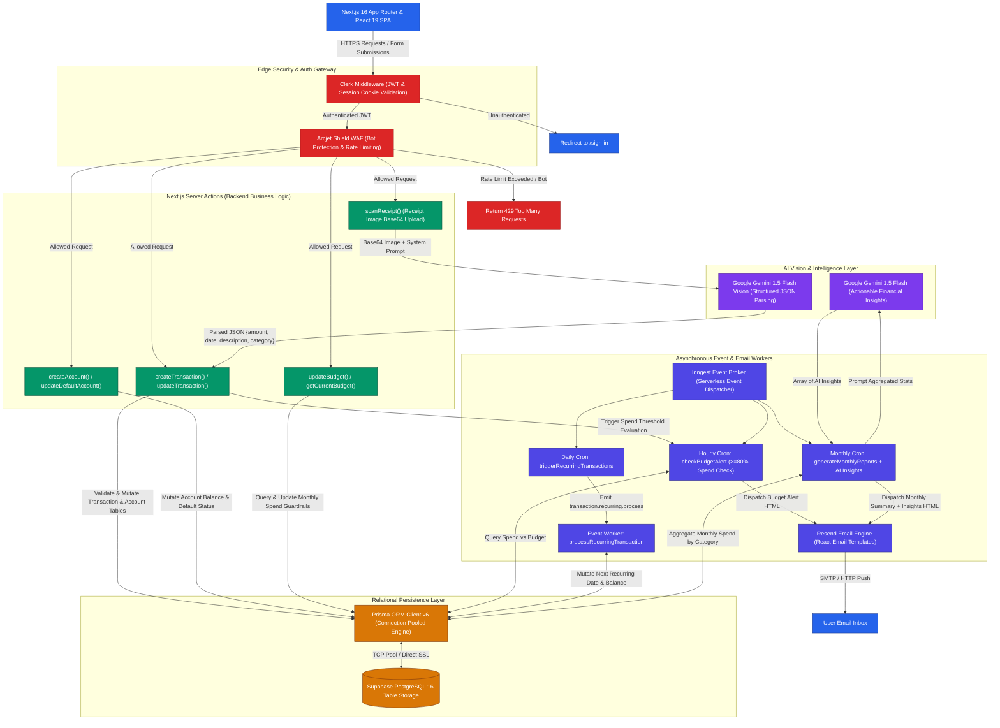
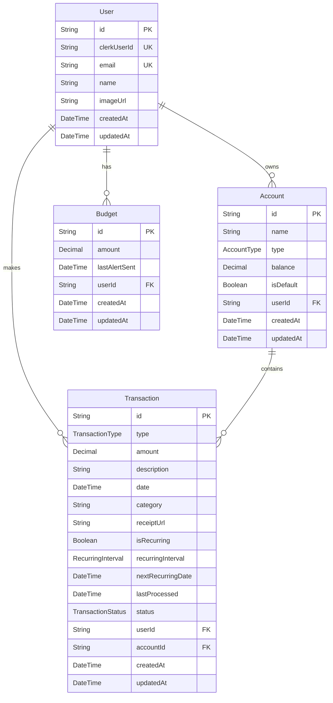

<div align="center">
  <br />
  <a href="https://fin-os-self.vercel.app/">
    
  </a>
  <h1>FinOS</h1>
  <p><strong>Your Intelligent, AI-Powered Financial Operating System</strong></p>
  <br />

  <!-- Badges -->
  <p>
    
    
    
    
    
    
  </p>

  <br />
  <a href="https://fin-os-self.vercel.app/">
    
  </a>
</div>

<br />

> **FinOS** is an autonomous personal finance operating system engineered with Next.js 16, Prisma ORM, and Tailwind CSS v4. It moves beyond passive expense tracking by combining a modern dark glassmorphism interface with **Google Gemini 1.5 Flash Vision** to scan receipts, parse unstructured financial data, automate budget alerts, and generate deep financial insights.

---

## 🚀 Live Deployment

FinOS is live and fully deployed on Vercel! Experience the intelligent financial operating system firsthand:

🌐 **Live Application URL**: [https://fin-os-self.vercel.app/](https://fin-os-self.vercel.app/)

---

## Table of Contents

- [🚀 Live Deployment](#-live-deployment)
- [🌟 Core Capabilities](#-core-capabilities)
- [🏗️ System Architecture](#️-system-architecture)
- [🗄️ Database Entity-Relationship Schema](#️-database-entity-relationship-schema)
- [💡 Technical Challenges & Solutions](#-technical-challenges--solutions)
- [🛠️ Tech Stack](#️-tech-stack)
- [📁 Project Structure](#-project-structure)
- [🔑 Environment Variables](#-environment-variables)
- [⚡ Quick Start](#-quick-start)
- [📄 License](#-license)

---

## 🌟 Core Capabilities

- **AI Receipt Parsing**: Upload receipts directly from your mobile device or desktop. Integrated **Google Gemini 1.5 Flash Vision** analyzes raw receipt images, extracts merchant names, line items, dates, and amounts, and automatically categorizes transactions into your database.
- **Multi-Account Aggregation**: Unified dashboard providing real-time visibility into current and savings balances. Track net worth trajectories, cash flow velocity, and spending habits in one centralized workspace.
- **Dynamic Budget Guardrails**: Set custom monthly budgets across diverse categories. Real-time visual progress bars notify you before spending thresholds are breached, emitting automated alerts when spend exceeds 80%.
- **Recurring Transaction Engine**: Forecast upcoming bills and subscription renewals automatically. Asynchronous daily workers check due dates and process recurring payments so you never miss a surprise renewal.
- **Automated AI Email Summaries**: Asynchronous background event workers powered by **Inngest** and **Resend** compile monthly financial health reports enriched with **Google Gemini AI** financial advice and dispatch them to your inbox.
- **Enterprise-Grade Security**: Edge-protected by **Arcjet WAF** to actively block SQL injection, bot attacks, and rate-limit abuse (capped at 1 request/minute per user for intensive mutations), seamlessly authenticated via **Clerk**.

---

## 🏗️ System Architecture

FinOS is built on a decoupled, serverless architecture that models clean boundaries between edge authentication, synchronous UI server actions, asynchronous background event queues, and multi-modal AI inference.



Infrastructure layers:

- **Next.js 16 App Router & React 19** handles server-side rendering, concurrent UI state (`useOptimistic`), and routing across dashboard pages.
- **Clerk & Arcjet WAF** provide edge-level JWT authentication, session management, strict bot protection, and customized rate-limiting guardrails before mutations reach the server.
- **Next.js Server Actions** execute synchronous business logic (`transaction.js`, `account.js`, `budget.js`, `dashboard.js`) directly on the backend without standalone REST controllers.
- **Google Gemini 1.5 Flash** powers multi-modal AI inference: parsing raw base64 receipt images into schema-compliant JSON objects and generating personalized monthly spending insights.
- **Prisma ORM & Supabase PostgreSQL** manage relational data persistence across strict entity schemas (`User`, `Account`, `Transaction`, `Budget`) with robust connection pooling.
- **Inngest Event Broker** orchestrates serverless background workers and scheduled cron jobs (`checkBudgetAlert`, `triggerRecurringTransactions`, `generateMonthlyReports`) outside Vercel's 10-second API timeout window.
- **Resend & React Email** compile dynamic HTML email templates and dispatch transactional alerts and monthly summaries directly to user inboxes.

---

## 🗄️ Database Entity-Relationship Schema

FinOS implements a strict relational database schema in PostgreSQL, managed via Prisma ORM for type-safe database queries.



---

## 💡 Technical Challenges & Solutions

1. **Serverless Timeout Evasion (Inngest Queues)**
   - **Challenge**: Processing automated monthly report calculations across thousands of transactions and dispatching bulk emails frequently hits the strict 10-second serverless execution timeout on Vercel.
   - **Solution**: Offloaded all asynchronous heavy lifting to **Inngest**. Server actions fire lightweight events (`transaction.recurring.process` or scheduled crons), allowing Inngest background job runners to handle throttling (10 tx/min per user), retries, and execution reliably without blocking synchronous API threads.

2. **Unstructured OCR Parsing (Gemini Vision JSON Schema)**
   - **Challenge**: Traditional OCR libraries return raw, unordered text strings from crumpled or low-light receipts, making reliable regex extraction impossible.
   - **Solution**: Integrated **Google Gemini 1.5 Flash Vision** with strict structured system prompts requesting exact JSON output matching our Prisma types (`amount`, `date`, `description`, `category`). This guarantees schema-compliant data ingestion directly into Server Actions.

3. **Optimistic UI Mutations (React 19 & Server Actions)**
   - **Challenge**: Users expect instantaneous dashboard feedback when logging transactions or adjusting budget bars, rather than waiting for database roundtrips.
   - **Solution**: Harnessed React 19 optimistic hook paradigms paired with Next.js 16 Server Actions. The UI updates immediately upon form submission while database mutations and cache revalidation (`revalidatePath`) run safely in the background.

---

## 🛠️ Tech Stack

| Layer | Technology | Purpose |
| :--- | :--- | :--- |
| **Frontend Framework** | **Next.js 16** (App Router) | React framework utilizing Server Components, Server Actions, and Turbopack |
| **UI Rendering** | **React 19** | Core rendering engine with advanced concurrent state and optimistic UI handling |
| **Styling & Design System** | **Tailwind CSS v4** & **shadcn/ui** | Utility-first glassmorphism styling and accessible Radix UI component primitives |
| **Animations & 3D** | **Framer Motion**, **GSAP**, **Three.js** | Micro-animations, dashboard transitions, smooth scrolling, and 3D canvas elements |
| **Data Visualization** | **Recharts** | Rendering dynamic spending charts, financial velocity, and net worth graphs |
| **Database & ORM** | **PostgreSQL** & **Prisma ORM v6** | Hosted Supabase SQL storage with type-safe relational queries and migrations |
| **Authentication** | **Clerk** | Secure user management, session validation, JWT middleware, and OAuth flows |
| **AI Vision & Insights** | **Google Gemini 1.5 Flash** | Multi-modal LLM for receipt image parsing and generating actionable advice |
| **Async Queues & Crons** | **Inngest v3** | Event-driven background orchestration, recurring billing logic, and scheduled crons |
| **Email Delivery** | **Resend** & **React Email** | Dispatching responsive HTML financial alerts and monthly summaries |
| **Security / WAF** | **Arcjet** | Edge firewall providing bot defense, shield protection, and strict rate limiting |

---

## 📁 Project Structure

```text
FinOS/
├── Backend/                 # Backend business logic & database infrastructure
│   ├── actions/             # Next.js Server Actions (account.js, budget.js, dashboard.js, transaction.js)
│   ├── database/            # Prisma client singleton & schema configuration
│   │   └── schema/          # schema.prisma models and enums
│   ├── security/            # Arcjet WAF defense & Clerk user synchronization checks
│   └── services/            # Background workflows & email templates
│       ├── emails/          # React Email templates (Budget Alert & Monthly Report)
│       └── inngest/         # Inngest client & scheduled function handlers
├── app/                     # Next.js 16 App Router pages, layouts, and route handlers
│   ├── (main)/              # Protected dashboard routes (account, dashboard, transaction)
│   └── api/                 # Webhook endpoints (inngest event receiver, database seeding)
├── components/              # Reusable React UI components & dashboard widgets
├── hooks/                   # Custom client hooks for UI state and financial calculations
├── lib/                     # Utility helpers and formatting constants
├── public/                  # Favicons, static logos, and illustrations
├── middleware.js            # Clerk authentication & Arcjet edge security interception
└── package.json             # NPM dependencies and build scripts
```

---

## 🔑 Environment Variables

Create a `.env` file in the project root with the following configuration keys:

| Variable Name | Description | Required |
| :--- | :--- | :--- |
| `DATABASE_URL` | Supabase PostgreSQL transactional connection pooled string | Yes |
| `DIRECT_URL` | Direct unpooled database connection string required for Prisma migrations | Yes |
| `NEXT_PUBLIC_CLERK_PUBLISHABLE_KEY` | Clerk frontend publishable authentication key | Yes |
| `CLERK_SECRET_KEY` | Clerk backend secret key for validating API sessions | Yes |
| `GEMINI_API_KEY` | Google AI Studio API key for receipt Vision analysis and insights | Yes |
| `RESEND_API_KEY` | Resend API key for dispatching transactional alert emails | Yes |
| `ARCJET_KEY` | Arcjet WAF security key for bot protection and rate limiting | Yes |
| `INNGEST_EVENT_KEY` | Inngest event signing key for triggering background workflows | Yes |

---

## ⚡ Quick Start

### 1. Clone & Install Dependencies
```bash
git clone https://github.com/shreedharkb/FinOS.git
cd FinOS
npm install
```

### 2. Configure Environment Variables
Copy the template file and fill in your Supabase, Clerk, Gemini, Resend, and Arcjet API keys:
```bash
cp .env.example .env
```

### 3. Synchronize Database Schema
Push the Prisma models to your PostgreSQL instance and generate the client library:
```bash
npx prisma db push
npx prisma generate
```

### 4. Launch Development Server
```bash
npm run dev
```

### 5. Start Background Job Runner (Optional)
To test asynchronous Inngest email triggers locally alongside your app:
```bash
npx inngest-cli@latest dev
```

Open [http://localhost:3000](http://localhost:3000) in your browser to experience FinOS!

---

## 📄 License

This project is licensed under the **GNU General Public License v3.0**.

---

<div align="center">
  <p>Built with ❤️ by <strong>Shreedhar K B</strong></p>
</div>
