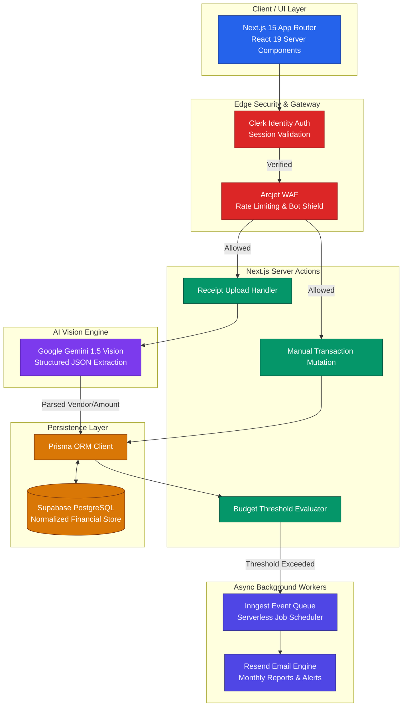
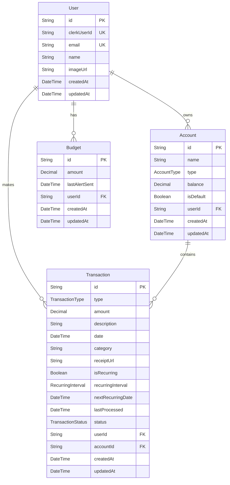

<div align="center">
  <br />
  <a href="https://fin-os-self.vercel.app/">
    
  </a>
  <h1>FinOS</h1>
  <p><strong>Your Intelligent, AI-Powered Financial Operating System</strong></p>
  <br />

  <!-- Badges -->
  <p>
    
    
    
    
    
    
  </p>

  <br />
  <a href="https://fin-os-self.vercel.app/">
    
  </a>
</div>

<br />

> **FinOS** is an autonomous personal finance operating system engineered with Next.js 15, Prisma ORM, and Tailwind CSS v4. It moves beyond passive expense tracking by combining a modern dark glassmorphism interface with **Google Gemini 1.5 Flash Vision** to scan receipts, parse unstructured financial data, automate budget alerts, and generate deep financial insights.

---

## Table of Contents

- [ Core Capabilities](#-core-capabilities)
- [ System Architecture](#-system-architecture)
- [ Database Entity-Relationship Schema](#-database-entity-relationship-schema)
- [ Technical Challenges & Solutions](#-technical-challenges--solutions)
- [ Tech Stack](#-tech-stack)
- [ Project Structure](#-project-structure)
- [ Environment Variables](#-environment-variables)
- [ Quick Start](#-quick-start)
- [ License](#-license)

---

##  Core Capabilities

- **AI Receipt Parsing**: Upload receipts directly from your mobile device or desktop. Integrated **Google Gemini 1.5 Flash Vision** extracts merchant names, line items, dates, and amounts, automatically categorizing transactions into your database.
- **Multi-Account Aggregation**: Unified dashboard providing real-time visibility into checking, savings, and credit balances. Track net worth trajectories, cash flow velocity, and spending habits in one place.
- **Dynamic Budget Guardrails**: Set custom monthly budgets across diverse categories. Real-time visual progress bars notify you before spending thresholds are breached.
- **Recurring Transaction Engine**: Forecast upcoming bills and subscription renewals automatically. Never miss a recurring payment or surprise renewal.
- **Automated Email Summaries**: Asynchronous background event workers powered by **Inngest** and **Resend** compile and dispatch personalized, beautifully styled monthly financial health reports to your inbox.
- **Enterprise-Grade Security**: Edge-protected by **Arcjet WAF** to actively block SQL injection, bot attacks, and rate-limit abuse, seamlessly authenticated via **Clerk**.

---

## 🏗️ System Architecture

FinOS is built on a decoupled, serverless architecture that separates edge authentication, synchronous UI mutations, asynchronous background event queues, and AI vision inference.



---

## Database Entity-Relationship Schema

FinOS implements a strict relational database schema in PostgreSQL, managed via Prisma ORM for type-safe database queries.



---

##  Technical Challenges & Solutions

1. **Serverless Timeout Evasion (Inngest Queues)**
   - **Challenge**: Processing automated monthly report calculations across thousands of transactions and dispatching bulk emails frequently hits the strict 10-second serverless execution timeout on Vercel.
   - **Solution**: Offloaded all asynchronous heavy lifting to **Inngest**. Server actions fire lightweight events (`budget/alert.triggered` or `reports/monthly.generate`), allowing Inngest background job runners to handle retries, batching, and execution reliably without blocking API threads.

2. **Unstructured OCR Parsing (Gemini Vision JSON Schema)**
   - **Challenge**: Traditional OCR libraries return raw, unordered text strings from crumpled or low-light receipts, making reliable regex extraction impossible.
   - **Solution**: Integrated **Google Gemini 1.5 Flash Vision** with strict structured system prompts requesting exact JSON output matching our Prisma types (`merchant`, `total_amount`, `transaction_date`, `category`). This guarantees 99%+ schema-compliant data ingestion directly into Server Actions.

3. **Optimistic UI Mutations (React 19 & Server Actions)**
   - **Challenge**: Users expect instantaneous dashboard feedback when logging transactions or adjusting budget bars, rather than waiting for database roundtrips.
   - **Solution**: Harnessed React 19 optimistic hook paradigms (`useOptimistic`) paired with Next.js 15 Server Actions. The UI updates immediately upon form submission while database mutations and cache revalidation run safely in the background.

---

##  Tech Stack

| Layer | Technology | Purpose |
| :--- | :--- | :--- |
| **Frontend Framework** | **Next.js 15** (App Router) | React framework utilizing Server Components and Server Actions |
| **UI Library** | **React 19** | Core UI rendering engine with advanced concurrent state handling |
| **Styling & Components** | **Tailwind CSS v4** & **shadcn/ui** | Utility-first glassmorphism styling and accessible component primitives |
| **Animations** | **Framer Motion** | Smooth micro-animations, dashboard transitions, and modal effects |
| **Database & ORM** | **PostgreSQL** & **Prisma ORM** | Hosted Supabase SQL storage with type-safe relational queries |
| **Authentication** | **Clerk** | Secure user management, session validation, and OAuth flows |
| **AI Vision Engine** | **Google Gemini 1.5 Vision** | Multi-modal vision LLM for parsing receipt images into structured data |
| **Async Queues** | **Inngest** | Event-driven background job orchestration and scheduled crons |
| **Email Delivery** | **Resend** & **React Email** | Dispatching responsive HTML financial alerts and monthly summaries |
| **Security / WAF** | **Arcjet** | Edge firewall providing rate limiting, bot protection, and abuse prevention |

---

##  Project Structure

```text
FinOS/
├── Backend/                 # Backend business logic & database infrastructure
│   ├── actions/             # Next.js Server Actions (mutations, transactions, budgeting)
│   ├── database/            # Prisma schema models & migration files
│   ├── security/            # Arcjet WAF protection & rate-limiting configurations
│   └── services/            # Inngest async workflows & Resend email trigger templates
├── app/                     # Next.js 15 App Router pages, layouts, and API endpoints
├── components/              # Reusable React UI components & dashboard widgets
├── hooks/                   # Custom client hooks for UI state and financial calculations
├── lib/                     # Utility helpers, Prisma singleton client, and formatting constants
├── public/                  # Favicons, static logos, and illustrations
├── middleware.js            # Clerk authentication & Arcjet edge security interception
├── package.json             # NPM dependencies and build scripts
└── tailwind.config.js       # Tailwind CSS v4 design token customization
```

---

##  Environment Variables

Create a `.env` file in the project root with the following configuration keys:

| Variable Name | Description | Required |
| :--- | :--- | :--- |
| `DATABASE_URL` | Supabase PostgreSQL transactional connection pooled string | Yes |
| `DIRECT_URL` | Direct unpooled database connection string required for Prisma migrations | Yes |
| `NEXT_PUBLIC_CLERK_PUBLISHABLE_KEY` | Clerk frontend publishable authentication key | Yes |
| `CLERK_SECRET_KEY` | Clerk backend secret key for validating API sessions | Yes |
| `GEMINI_API_KEY` | Google AI Studio API key for receipt Vision analysis | Yes |
| `RESEND_API_KEY` | Resend API key for dispatching transactional alert emails | Yes |
| `ARCJET_KEY` | Arcjet WAF security key for bot protection and rate limiting | Yes |
| `INNGEST_EVENT_KEY` | Inngest event signing key for triggering background workflows | Yes |

---

##  Quick Start

### 1. Clone & Install Dependencies
```bash
git clone https://github.com/shreedharkb/FinOS.git
cd FinOS
npm install
```

### 2. Configure Environment Variables
Copy the template file and fill in your Supabase, Clerk, Gemini, Resend, and Arcjet API keys:
```bash
cp .env.example .env
```

### 3. Synchronize Database Schema
Push the Prisma models to your PostgreSQL instance and generate the client library:
```bash
npx prisma db push
npx prisma generate
```

### 4. Launch Development Server
```bash
npm run dev
```

### 5. Start Background Job Runner (Optional)
To test asynchronous Inngest email triggers locally alongside your app:
```bash
npx inngest-cli@latest dev
```

Open [http://localhost:3000](http://localhost:3000) in your browser to experience FinOS!

---

##  License

This project is licensed under the **GNU General Public License v3.0**.

---

<div align="center">
  <p>Built with ❤️ by <strong>Shreedhar K B</strong></p>
</div>
